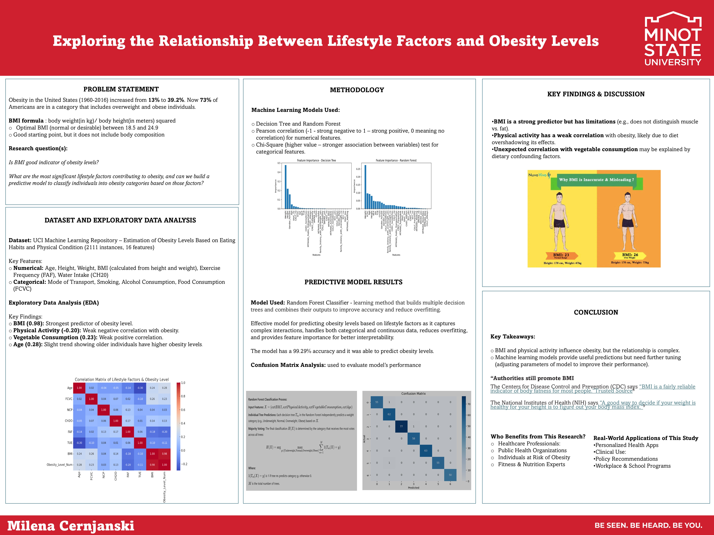

# Obesity & Lifestyle Factors Analysis

## Project Overview
This project explores the relationship between lifestyle behaviors and obesity levels using a structured obesity dataset that includes dietary habits, physical activity, and demographic factors. The goal is to identify patterns and behaviors that are most strongly associated with increased obesity risk.

The analysis is conducted using Python, focusing on data cleaning, exploratory data analysis (EDA), and visualization to uncover meaningful insights.

Key questions addressed in this project:
- How do eating habits relate to obesity levels?
- Does physical activity frequency impact obesity classification?
- Which lifestyle factors are most associated with higher obesity risk?
- How are obesity levels distributed across the dataset?

---

## Dataset Description
The project uses the **Obesity Levels Dataset**, which contains individual-level data related to health and lifestyle behaviors.

Key features include:
- Dietary habits (e.g., vegetable intake, high-calorie food consumption)
- Physical activity frequency
- Transportation habits
- Demographic variables
- Obesity level classification (target variable)

The dataset combines real and synthetic data and is commonly used in obesity-related data science research.

---

## Important Notes About the Data
- The target variable represents **multiple obesity categories**, not a binary outcome.
- Several features are categorical and required encoding prior to analysis.
- Lifestyle and dietary data are self-reported and may contain bias.
- Initial inspection and validation were required despite partial pre-cleaning.

---

## Data Preparation & Cleaning Steps
- Loaded the dataset using **pandas**.
- Inspected data structure, data types, and feature distributions.
- Checked for missing and inconsistent values.
- Encoded categorical variables where necessary.
- Verified obesity class balance.
- Prepared data for exploratory analysis and visualization.

These steps ensured the dataset was clean, consistent, and analysis-ready.

---

## Exploratory Analysis & Visualizations

### Obesity Level Distribution
- Visualized the frequency of each obesity category.
- Identified prevalence and class balance across obesity levels.

### Lifestyle Factors vs Obesity
- Explored relationships between obesity levels and:
  - Physical activity frequency
  - Dietary behaviors
  - Transportation type
- Highlighted behavioral patterns associated with higher obesity risk.

### Physical Activity Analysis
- Examined how exercise frequency correlates with obesity classification.
- Compared sedentary and active individuals.

### Dietary Patterns
- Analyzed the impact of eating behaviors on obesity levels.
- Observed trends between diet quality and obesity classification.

---

## Project Use Case
This project is designed to answer the question:

> **How do everyday lifestyle choices influence obesity risk?**

It can be used for:
- Public health analysis
- Academic research
- Data science portfolios
- Preliminary analysis before predictive modeling

---

## Tools Used
- **Python**
- **Pandas** – Data manipulation
- **Matplotlib / Seaborn** – Data visualization
- **Jupyter Notebook** – Analysis environment

---

## Key Insights & Conclusion
- Lifestyle behaviors such as physical activity and dietary habits show clear associations with obesity levels.
- Lower activity levels and poorer dietary patterns are linked to higher obesity categories.
- Obesity risk is influenced by a combination of factors rather than a single behavior.
- The dataset provides a strong foundation for future modeling or policy-focused analysis.

---

## Files
- `ObesityLevels.ipynb` – Data analysis notebook
- `ObesityDataSet_raw_and_data_sinthetic.csv` – Dataset
- `Presentation.pptx` – Project presentation
- `README.md`

---

## Author
**Milena Cernjanski**
